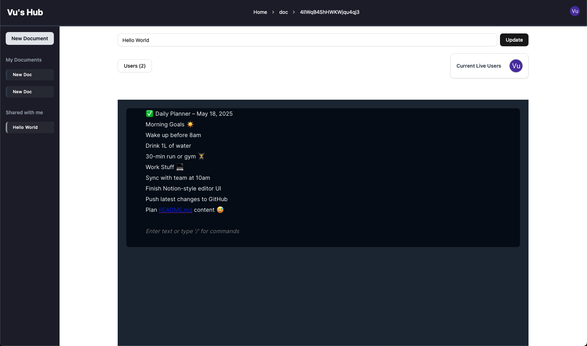

# WorkNest - Collaborative Document Editor

A real-time collaborative document editor built with React, Next.js, TypeScript, and Liveblocks.

*WorkNest - A modern collaborative document editor with real-time features*

## 🛠️ Tech Stack

- **React 18** - UI library for building interactive user interfaces
  - Hooks (useState, useEffect, useCallback, useMemo)
  - Server & Client Components
  - Context API for state management
- **Next.js 14** - React framework with App Router
- **TypeScript** - Type-safe JavaScript
- **Tailwind CSS** - Utility-first CSS framework
- **Shadcn/ui** - UI component library
- **Firebase** - Database, Authentication, Storage
- **Liveblocks** - Real-time collaboration infrastructure
- **Yjs** - CRDT for collaborative document editing
- **BlockNote** - Rich text editor with collaboration
- **Clerk** - Authentication
  
## ✨ Features

- React-powered UI with optimized rendering
- Server and client components for improved performance
- Real-time collaborative document editing
- User presence and cursor awareness
- Document translation
- Document management (create, delete)
- User invitations
- Responsive design

## 📝 Getting Started

1. Clone the repository
2. Install dependencies: `npm install`
3. Set up environment variables in `.env.local`
4. Run development server: `npm run dev`

## 📄 Environment Variables

Create a `.env.local` file with the following:

NEXT_PUBLIC_LIVEBLOCKS_ID=your_liveblocks_key
NEXT_PUBLIC_CLERK_PUBLISHABLE_KEY=your_clerk_key
CLERK_SECRET_KEY=your_clerk_secret
NEXT_PUBLIC_BASE_URL=your_api_url

## Learn More

To learn more about Next.js, take a look at the following resources:

- [Next.js Documentation](https://nextjs.org/docs) - learn about Next.js features and API.
- [Learn Next.js](https://nextjs.org/learn) - an interactive Next.js tutorial.

You can check out [the Next.js GitHub repository](https://github.com/vercel/next.js) - your feedback and contributions are welcome!

## Deploy on Vercel

The easiest way to deploy your Next.js app is to use the [Vercel Platform](https://vercel.com/new?utm_medium=default-template&filter=next.js&utm_source=create-next-app&utm_campaign=create-next-app-readme) from the creators of Next.js.

Check out our [Next.js deployment documentation](https://nextjs.org/docs/app/building-your-application/deploying) for more details.
